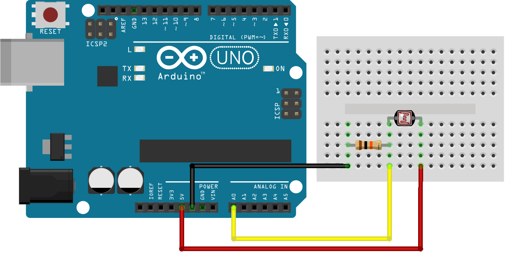
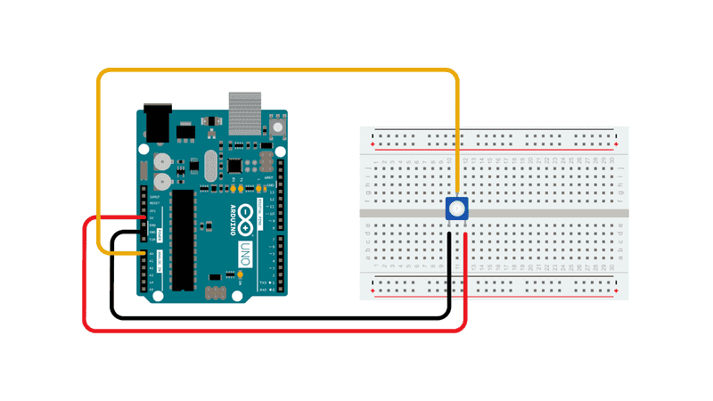
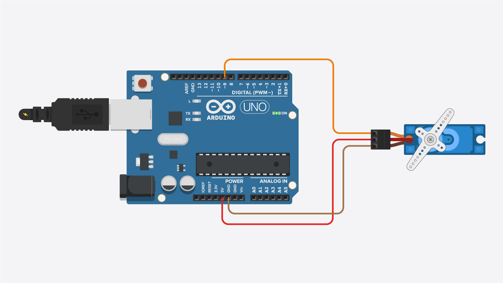
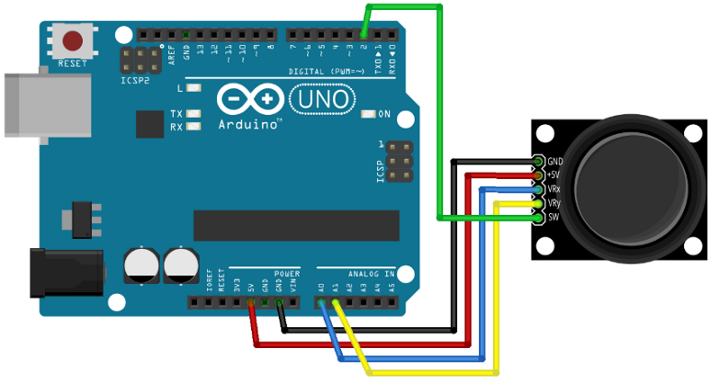
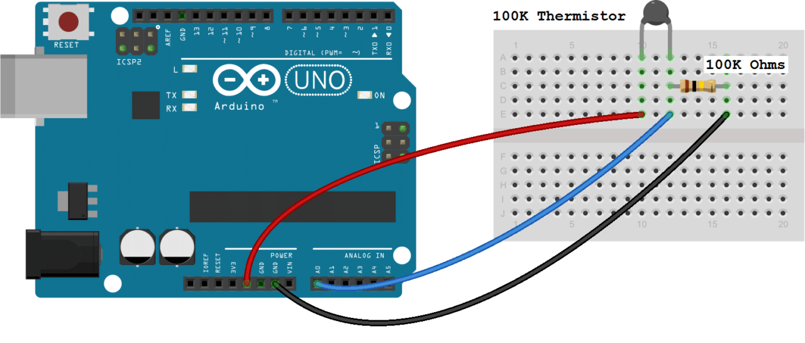

# Workshop 3 - ESP32 Analog

## Activities:
### *** *Note: Remember which pins we use for analog INPUT (ADC) vs analog OUTPUT* ***

#### Activity 1 - Piezo Buzzer
* Make a theremin (musical instrument) using a photoresistor to control the pitch of a piezo buzzer
* Play a scale with individual pitches
  - Alternatively, use a potentiometer to control pitch
* Relevant functions
  ```c++
  tone(pin, frequency);             //assigns a tone to the specified pin
  tone(pin, frequency, duration);   //assigns a tone to the specified pin for specified duration
  delay(milliseconds)               //can create a pause between notes
  noTone(pin)                       //turns off the tone
  //IMPORTANT NOTE: if you use tone(pin, frequency, duration) and then delay(ms), the delay must be equal to
  //the duration of the tone PLUS the amount of pause you want after it
  ```
* Revelant components
  - Piezo Buzzer: 
  
  - Photoresistor: Can be wired in both directions, since it isn't a diode.
  
  - Potentiometer: Can also be wired in both directions, connect power to either the left or right most pin.
  

#### Activity 2 - Servo Motors
* Program the Servo to sweep back and forth automatically
* Then use a potentiometer or joystick to control the servo manually
* Initializing Servo (above void setup)
  ```c++
  #include <Servo.h>    //allows you to use the servo library
  Servo myservo;        //names your servo and assigns it as a servo
  ```
* Relevant functions
  ```c++
  //(replace "myservo" with your chosen name)
  myservo.attach(pin)   //assigns the servo pin (place in void setup)
  myservo.write(angle)  //tells your servo to move to a specified angle 
  ```
* Revelant Components
  - Servo:
  
  - Joystick:<br>
  
  <br>Practice searching online for how to wire and code a Joystick, then try to incorporate it into your code to achieve the same function.
  Some useful links: [Connect Joystick 1](https://www.instructables.com/Connect-and-Use-Joystick-With-Arduino/), [Connect Joystick 2](https://lastminuteengineers.com/joystick-interfacing-arduino-processing/)

#### Activity 3 - Light-Level sensor
* Use a photoresistor to measure brightness
  - Pinch and release the photoresistor to see light level changes
  - Graph using Serial Plotter
  - Alternatively, use thermistor to measure temperature by pinching & releasing the thermistor to see tempearture changes
* Relevant Components
  - Thermistor: Can be connected in both directions, as it does not have polarity.
  
  Learn more about the thermistor, how it works, and how to code it at 


#### Activity 4 - Night Light
* Make a night light using a photoresistor and an LED (The LED turns on when the room is dark) 


#### Challenge Activity - Reaction Time Test (Optional)
* Use an LED and a piezo buzzer to make a fun game! Have the LED or piezo buzzer turn on randomly so that the user has to press the button as fast as possible to turn it off. Have the reaction speed be printed in the serial monitor each time. See who has the fastest reaction times :)
* Relevant functions
  ```c++
  random(start of range, end of range); //output a random number between the defined range
  randomSeed(integer seed value); //initializes the random number generator, each seed value corresponds
                                  //to a particular pseudorandom number list
  //question: How to get a truly random number generator each time the code is restarted?
  //What on the Arduino can output relatively random values?
  ```


#### Challenge Activity - Dino Run (Optional)
* Use the servo and photoresistor to play the Google dino game automatically up to 300 points. (Bonus: Try to get the highest score possible.)


<!--
## Solutions:
* [Activity 1 - Piezo Buzzer](https://bmesbuildteamucla.github.io/workshops/workshop-3--arduino-analog/activity-1--piezo-buzzer)
* [Activity 2 - Servo motors + Joystick](https://bmesbuildteamucla.github.io/workshops/workshop-3--arduino-analog/activity-2--servo-motor)
* [Activity 3 - Light Level Sensor](https://bmesbuildteamucla.github.io/workshops/workshop-3--arduino-analog/activity-3--light-level-sensor)
* [Activity 4 -  Night Light](https://bmesbuildteamucla.github.io/workshops/workshop-3--arduino-analog/activity-4--night-light)


hide solutions
* [Challenge Activity - Reaction Time Test](https://bmesbuildteamucla.github.io/workshops/workshop-3--arduino-analog/challenge-activity-2--reaction-time-test)
* [Challenge Activity - Dino Run](https://bmesbuildteamucla.github.io/workshops/workshop-3--arduino-analog/challenge-activity-1--dino-run)
-->
