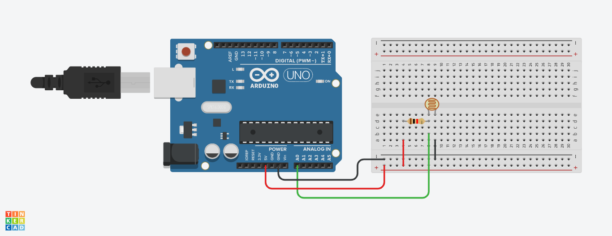

# [Workshop 3 - ESP32 Analog](https://bmesbuildteamucla.github.io/workshops/workshop-3--esp32-analog)

## Activity 3 - Light-Level sensor

### Task:
* Use a photoresistor to measure brightness
  - Pinch and release the thermistor to see light level changes
  - Graph using Serial Plotter
  - Alternatively, use thermistor to measure temperature by pinching & releasing the thermistor to see tempearture changes
* Relevant Components
  - Thermistor: Can be connected in both directions, as it does not have polarity.
  
  Learn more about the thermistor, how it works, and how to code it at https://www.circuitbasics.com/arduino-thermistor-temperature-sensor-tutorial/

### Circuit:


Thermistor can be substituted with photoresistor

### Code:
```c++
void setup()
{
  Serial.begin(9600);   // initiate Serial Monitor
}

void loop()
{
  Serial.println(analogRead(A0));   // open up Serial Plotter to see graphed values
}
```
