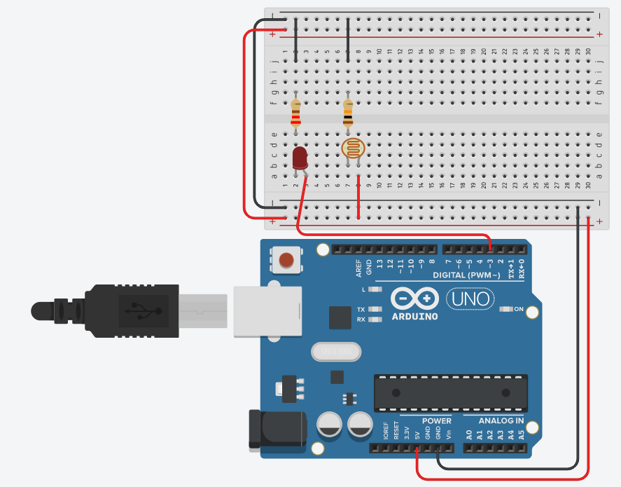

# [Workshop 3 - ESP32 Analog](https://bmesbuildteamucla.github.io/workshops/workshop-3--esp32-analog)

## Activity 4 - Night Light

### Task:
* Make a night light using a photoresistor and an LED (The LED turns on when the room is dark) 

### Circuit:



### Code:
```c++
int photo = A1;
int led = 3;
int calibrate = 0;

void setup() {
  pinMode(led, OUTPUT);
  digitalWrite(led, LOW);
  Serial.begin(9600);

  Serial.println("Please calibrate the night light");   //This part is optional, but it allows for greater
  while (calibrate <= 0) {                              //user control over what light level turns on the
    if (Serial.available() > 0) {                       //night light. You could instead just set calibrate
      calibrate = Serial.parseInt();                    //to a fixed value between 0 and 1023.
    }
  }
  
}

void loop() {
  int light = analogRead(photo);
  Serial.println(light);
  if (light < calibrate) {                              //Check with an if statement whether light levels
      digitalWrite(led, HIGH);                          //from the photoresistor are low enough to turn on
  }                                                     //the LED.

  else {                                                //If the light level is not low enough, then the
    digitalWrite(led, LOW);                             //LED is off.
  }
}
```
