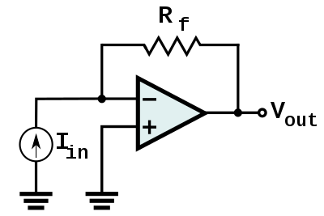
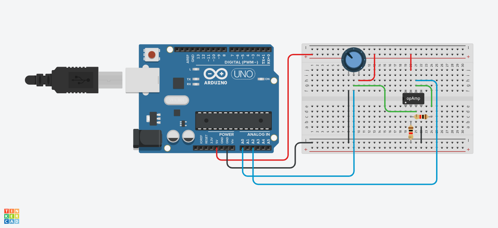
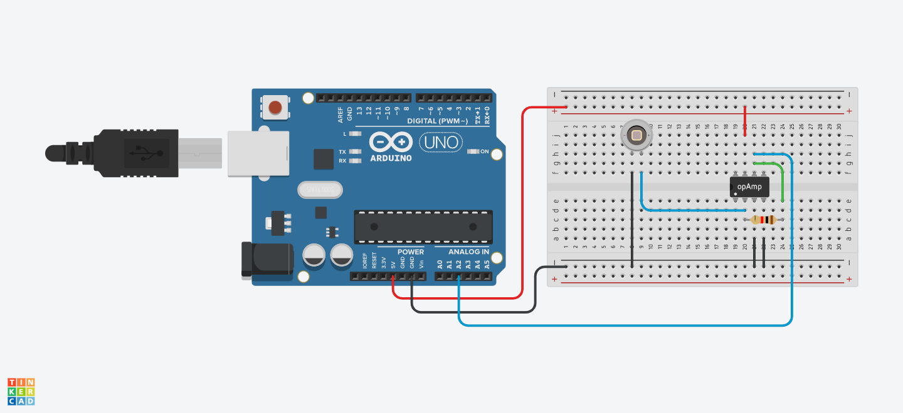

# Workshop 4 - Advanced Circuitry
[Attendance Form](https://docs.google.com/forms/d/e/1FAIpQLSdThOHz1SEjTVpSlDJppF5OURFrmhMXBVgEIb7zYX_eA_gakQ/viewform?usp=dialog)

## Activities:

#### Activity 1 - Set Up Circuits
* Set up a potentiometer circuit (potentiometer is a voltage divider, with the top pin of the potentiometer serving as Vout)
* Set up separate op amp circuit with 3.3V and GND pins attached
  - *Hint: Search up op amp data sheet to determine pin configuration*
  - *VDD is (+), VSS is (-)*
  - use opamp MCP6041

#### Activity 2 - Inverting Amplifier
* Set up an inverting amplifier circuit with the potentiometer output as Vin

    

* Simultaneously measure the voltage from the potentiometer and the op amp
  <details>
  <summary>(Click me) What is the op amp's output voltage?</summary>
  <br>
  The op amp's output voltage is 0V
  <br>
  <br>
      <details>
      <summary>Why? (Think before opening)</summary>
      <br>
      An op amp can only produce an output voltage within the range of voltages that it's supplied with (ex: 0V - 5V). By using an inverting amplifier, you are telling the op amp to produce a negative output voltage. However, the lowest voltage it is supplied with is 0V, so the output voltage is 0V. (This should hold true for low voltages, but since the ESP32 has limitations, there may be a signal present at higher input voltages.)
      <br>
      </details>
  </details>

#### Activity 3 - Non-inverting Amplifier
* Set up an non-inverting amplifier circuit with the potentiometer output as Vin

    
* Simultaneously measure the voltage from the potentiometer and the op amp
* Compare the two voltages and see if they match the expected gain


#### Activity 4 - Transimpedance Amplifier
* Set up a transimpedance amplifier circuit with an PD204 photodiode as the current source. Try to use a high value resistor (example: 1 megaohm) to make sure you can see the photodiode signal since the photodiode outputs a very low magnitude current.

    

* Measure the voltage from the op amp and see how it changes when you cover the photodiode
  <details>
  <summary>(Click me) What's so important about this amplifier?</summary>
  <br>
  This is the basis of our Pulse Ox circuit! Place your finger on the photodiode and shine a red LED on top of your fingernail. Keep everything steady and see if you can detect your pulse!
  <br>
  <br>
      
  </details>

#### Activity 5 - Filters
* Set up a low pass and high pass filter
  - Filter your potentiometer output using each filter and observe what happens
  - You can read in both the unfiltered and filtered signals through your ESP32 and monitor using the Serial Plotter
  - Try to filter at different frequencies by using different resistors/capacitors and see their effect on filtering
    - Long capacitor is 4.7 μF and short capacitor is 6.8 μF
  - Turn the potentiometer dial quickly/slowly and see the effect it makes on the output graph. Does this match your expectations for the different filter types?
  
* Combine the low pass and high pass filters together to create a band pass filter
  - Compare with using each filter by itself
#### Activity 6 - Putting it all together
* Connect the output of Activity 4 (Transimpedance amplifier) to the input of Activity 5 (Filters). Connect the output of the filter to an analog pin on the ESP32 and plot your data! This is the complete circuit capable of measuring your pulse!
  - Fine tune the transimpedance amplifier resistor and filter resistor to get a clear signal. If you have time, you can try calculating your pulse. 
  - You will have group work time to find the ideal values, so solutions for Activity 6 will not be posted
    <details>
    <summary>(Click me) What type of filter should you use? Hint: your pulse is comprised of low frequency signals (<30 Hz), and there is known noise at 60 Hz</summary>
    <br>
    You should use a low-pass filter to allow your low frequency pulse signal to "pass" through the filter while filtering out the noise. Choose an appropriate cutoff frequency given f=1/(2*pi*R*C) Hz, with R and C being the values of the resistor and capacitor. 
    <br>
    <br>
    </details>
<!-- #### Activity 6 - Processing + ESP32
* Set up a button circuit
  - Feel free to try with any input component you prefer ex.potentiometer, potoresistor etc.
* Set up connection between Processing and Arduino
  - Upload Standard Firmata code to Arduino
    - Remeber: this code has to be uploaded again everytime before switching from Arduion IDE to Processing!!!
  - In Processing, make sure to include these three lines of code:

    

* Code Processing to draw a circle everytime the button is pressed
  - Feel free to make Processing draw or add any shape/color/effects in response to the input from your chosen component -->

<!--
## Solutions:
#### Activity 3 - Non-inverting Amplifier
* Circuit:

    
    
* Code:
    ```c++
    void setup()
    {
      Serial.begin(9600);
    }

    void loop()
    {
      Serial.print("Original: ");
      Serial.print(analogRead(A0));
      Serial.print("	");
      Serial.print("Amplified: ");
      Serial.println(analogRead(A2));
    }
    ```

#### Activity 4 - Transimpedance Amplifier
* Circuit:

    
    
* Code:
    ```c++
    void setup()
    {
      Serial.begin(9600);
    }

    void loop()
    {
      Serial.println(analogRead(A2));
    }
    ```
-->
