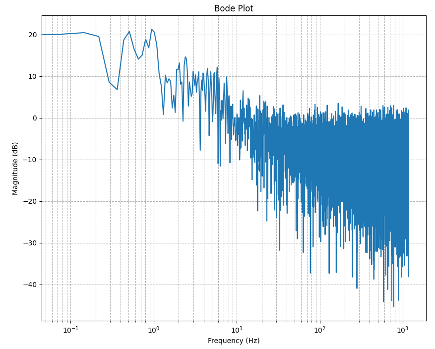

#### Activity 1 - Transimpedance Amplifier and Processing
1. Set up a transimpedance amplifier circuit with an OP905 photodiode as the current source and an appropriate resistor value (try 1 megaohm or higher).

    

2. Plot the output from the transimpedance amplifier using the Serial Plotter.
<!-- 3. Print the output values on the Processing console.
  * Make sure you include these lines of code at the top of your Processing code and upload Standard Firmata from Arduino IDE each time you unplug your Arduino or switch from Arduino IDE code to Processing code
  ```c++
  import processing.serial.*;
  import cc.arduino.*;
  import org.firmata.*;
  ``` -->
3. Attach a red LED and use it with the sensor (this is the basic pulse ox). We recommend using the jumper wires with male/female ends to connect the LED.
4. Visualize the signal using the Serial Plotter
<!-- 5. Using Processing, try to plot the pulse ox signal (use the `line()` function). -->

#### Activity 2 - Amplifying Signal
* Analyze the signal that you are receiving
  - How big is the signal?
  - Is the pulse graph visible yet?
* Add an appropriate non-inverting amplifier circuit
  - Calculate the theoretical gain
* Your plot should look something like this:


#### Activity 3 - Filtering Signal
* At this point, you should be able to see your pulse, but it should be very noisy.
  - I.e. you should have the photodiode connected to the transimpedance amplifier and non-inverting amplifier and are taking an output from the non-inverting amplifier.
* Analyze the amplified signal
  - What frequencies do you need to filter out?
  - Is the pulse graph distinguishable?
  - Inspect the following graph of signal magnitude vs frequency. Notice the noise past around 20 Hz
  
* Add appropriate filter(s) and experiment with different filter frequencies
  - What type of filter is required? 
  - Calculate the theoretical cutoff frequencies with the information from Module 4
    
#### Activity 4 - PCB Design
* **Please read this entire section before working on your design**
* By now you should have a functioning circuit on your breadboard! 
* Now it's time to translate your circuit into a PCB design. Keep in mind that the example we showed in Module 6 was not the full circuit design. Your PCB design should include the following:
  - Red LED circuit (don't forget resistor!)
  - Photodiode (connected to transimpedance amp)
    - You can just use the same part as you did for the red LED because the diodes have the same footprint (see note below)
  - Both of your operational amplifier circuits (2 op amps total plus resistors)
  - Your low pass filter circuit (resistor and capacitor)
  - IR LED circuit (if you added this)
* **Use the following parts (NOT the parts we showed in Module) - Just copy and paste these into the add parts menu**
  - ***Resistors***: R. When placing, set the footprint to `Resistor_THT:R_Axial_DIN0207_L6.3mm_D2.5mm_P7.62mm_Horizontal`
  - ***Red LED, IR LED, and photodiode***: LED. When placing, set the footprint to `Footprint	LED_THT:LED_D5.0mm`
  - ***Capacitor***: C. When placing, set the footprint to `Capacitor_THT:C_Axial_L5.1mm_D3.1mm_P10.00mm_Horizontal`
  - ***Op Amps***: (a little more complicated)
    - ```Download Symbol and Footprint``` from this [Build Team KiCad Libraries](https://drive.google.com/drive/folders/1hwNMpJOX8Vhz9xLJ0M-7wDrhA3pnRFuU?usp=drive_link).
    - Follow these [instructions](https://www.snapeda.com/about/import/?plugin=&prev_ref=#KiCad6) to import the library into KiCad. Or, watch the video in the [KiCad Tutorials folder](https://drive.google.com/drive/folders/1Ws-rUEyWAYt_4fxkrh3LIJb50ylhu5OX?usp=drive_link)
    - You should now be able to find it in the add parts menu!
  - ***ESP32***: Follow the video in the [KiCad Tutorials folder](https://drive.google.com/drive/folders/1Ws-rUEyWAYt_4fxkrh3LIJb50ylhu5OX?usp=drive_link)
* We didn't show this in Module, but we recommend moving all of your parts on top of the ESP32 footprint so that your PCB is as small as possible (could fit on top of your casing)
* ***Do not order your PCB without approval from the Project Managers!***
* Important notes about PCBs:
  - The printed circuit board doesn't actually come with the parts, it just comes with "wires" that connects the parts and the holes that you solder your own parts onto. For your device, this includes the diodes (LEDs and photodiode), resistors, and op amps.
  - The footprint of a part is like its map or outline. It's the spot on your PCB where your part will go, and it has a specific size, shape, number of holes, and distance of holes. These holes are where you will solder on the legs of your part.
  - Soldering is a permanent method of attaching two metal parts together. It is the permanent version of plugging a wire or the legs of a circuit component into your breadboard. You use a hot pen-like device to add liquid metal that connects your PCB to the legs of the part you are attaching. This is the final step of building your PCB!
